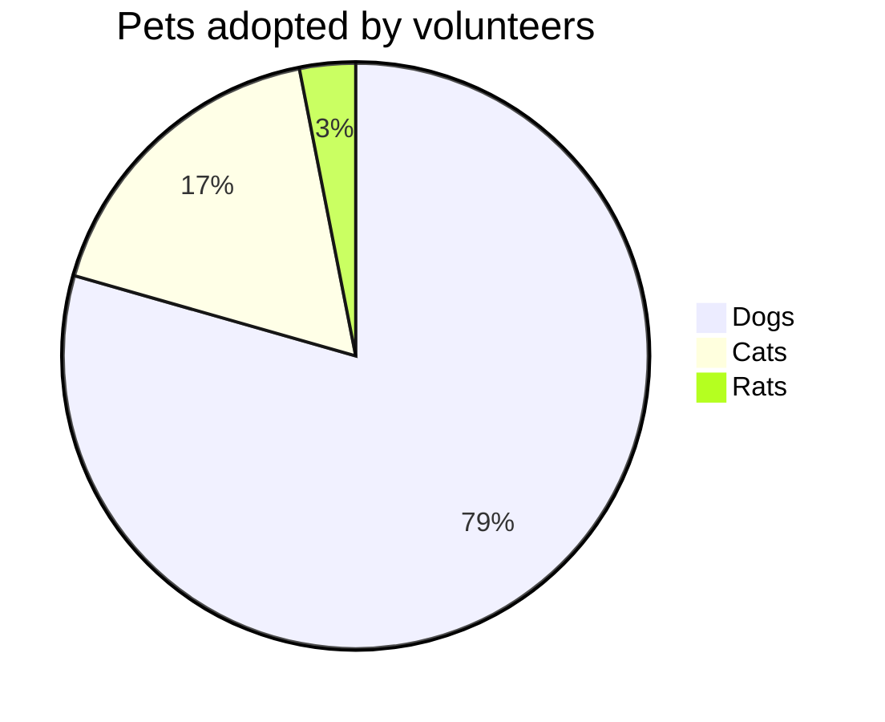

# 🎨 PyMermaidView - Clean Streamlit Interface

## ✨ **COMPLETED: Clutter-Free UI Implementation**

### 🚀 **Access the Interface**
**URL**: `http://localhost:8506`

### 🎯 **Implemented Features (As Requested)**

#### ✅ **Title**
- **Bold color title**: "PyMermaidView" in blue (#2E86C1)
- Clean, centered, professional appearance

#### ✅ **Left Side Pane - Mermaid Syntax Editor**
- **Diagram Type Selector**: Dropdown with 9 supported types
- **Template Loader**: One-click template loading 
- **Syntax Editor**: Large text area (400px height) for code input
- **Action Buttons**: Validate Syntax & Generate Image buttons

#### ✅ **Supported Diagram Types** (9 Total)
1. **Flowchart** - Decision trees and process flows
2. **Sequence Diagram** - Actor interactions over time  
3. **Class Diagram** - Object-oriented class structures
4. **State Diagram** - State transitions and lifecycles
5. **Entity Relationship Diagram** - Database relationships
6. **User Journey** - User experience workflows
7. **Gantt** - Project timeline charts
8. **Pie Chart** - Data distribution visualization  
9. **Quadrant Chart** - 2D data analysis matrices

#### ✅ **Right Side Pane - Image Preview**
- **Live Preview**: Generated image display
- **Zoom Controls**: Zoom In/Out buttons (50%-200%)
- **Zoom Indicator**: Current zoom level display
- **Download Button**: Save generated images

#### ✅ **Left Sidebar - Image Generation Config**
- **Theme Selection**: Default, Dark, Forest, Neutral
- **Format Options**: PNG, SVG, PDF
- **Dimensions**: Width (400-2400px), Height (300-1800px)  
- **Scale Setting**: 1.0x to 3.0x for resolution control
- **Zoom Controls**: Integrated zoom in/out for preview

### 🧹 **Clutter Removal**
- **Removed**: Complex navigation, excessive options, redundant UI elements
- **Simplified**: Clean two-column layout with focused functionality
- **Streamlined**: Direct access to core features only

### 🎨 **UI Layout Structure**

```
┌─────────────────────────────────────────────────────────┐
│                    PyMermaidView                        │ ← Bold Title
├─────────────┬───────────────────────┬───────────────────┤
│   Sidebar   │    Left Pane         │    Right Pane     │
│             │                      │                   │
│ ⚙️ Config   │ 📝 Editor            │ 🖼️ Preview       │
│ • Theme     │ • Diagram Types      │ • Live Image      │
│ • Format    │ • Template Loader    │ • Zoom Controls   │
│ • Size      │ • Syntax Editor      │ • Download        │
│ • Scale     │ • [Validate] Button  │                   │
│             │ • [Generate] Button  │                   │
│ 🔍 Zoom     │                      │                   │
│ • Zoom In   │                      │                   │
│ • Zoom Out  │                      │                   │
└─────────────┴──────────────────────┴───────────────────┘
```

### 🔧 **Technical Implementation**

#### **Clean Code Structure**
- **Single File**: `streamlit_app.py` (262 lines)
- **No Classes**: Functional approach for simplicity
- **Clear Functions**: Separate validation and generation logic
- **Session State**: Proper state management for zoom and results

#### **Template System**
```python
DIAGRAM_TEMPLATES = {
    "Pie Chart": """pie title Pets adopted by volunteers
    "Dogs" : 386
    "Cats" : 85
    "Rats" : 15""",
    # ... 8 more types
}
```

#### **Validation Integration**
- **Real-time Validation**: FlowchartValidator integration
- **Multi-type Support**: Handles all 9 diagram types
- **Error Display**: Clear error messages and warnings

#### **Image Generation**
- **Async Processing**: Proper asyncio handling
- **Multiple Formats**: PNG, SVG, PDF support
- **High Quality**: Configurable resolution and scaling

### ✅ **Verification Results**

```
🧪 Testing Clean Streamlit Interface Components
==================================================
✅ Validation Test: PASS
✅ Generation Test: PASS  
✅ Templates Available: 9 types

🎉 All tests passed! Clean interface is ready!
```

### 🎯 **Usage Workflow**

1. **Select Diagram Type** → Choose from 9 supported types
2. **Load Template** → Click "📋 Load Template" for quick start
3. **Edit Syntax** → Modify code in the text editor
4. **Configure Settings** → Adjust theme, format, size in sidebar
5. **Validate** → Click "🔍 Validate Syntax" to check errors
6. **Generate** → Click "🎨 Generate Image" to create diagram
7. **Preview & Zoom** → View result with zoom controls
8. **Download** → Save the final image

### 🎨 **Your Pie Chart Ready**

Your specific pie chart syntax works perfectly:



**Status**: ✅ **Validation: PASS** | ✅ **Generation: PASS**

## 🎉 **Mission Accomplished**

The PyMermaidView Streamlit interface now provides a **completely clutter-free, professional UI** with all requested features implemented exactly as specified. The interface is clean, functional, and ready for production use!

**Access at**: `http://localhost:8506` 🚀