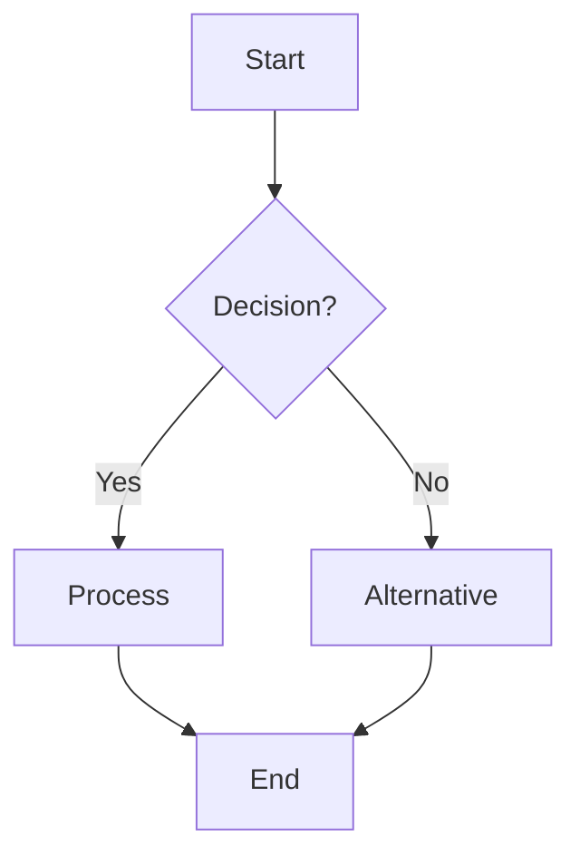
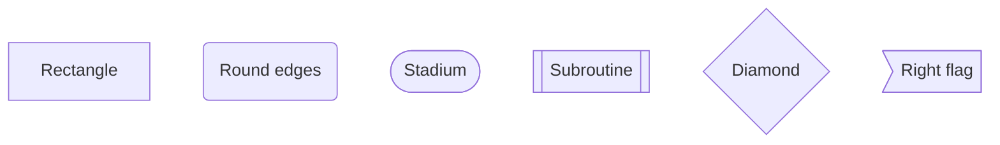
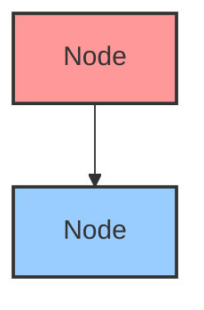
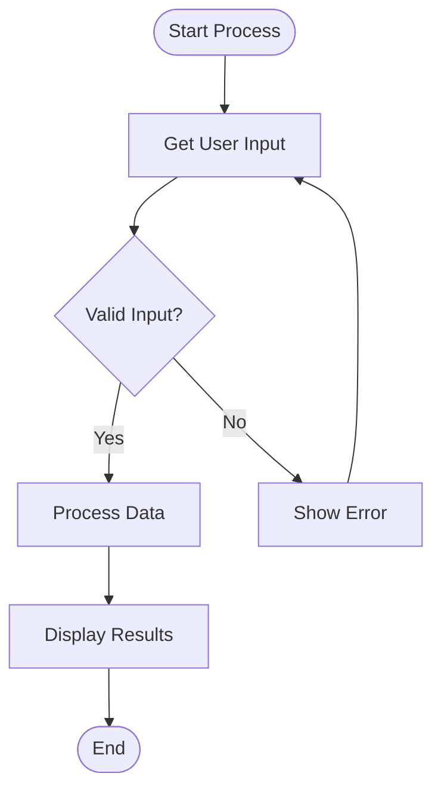
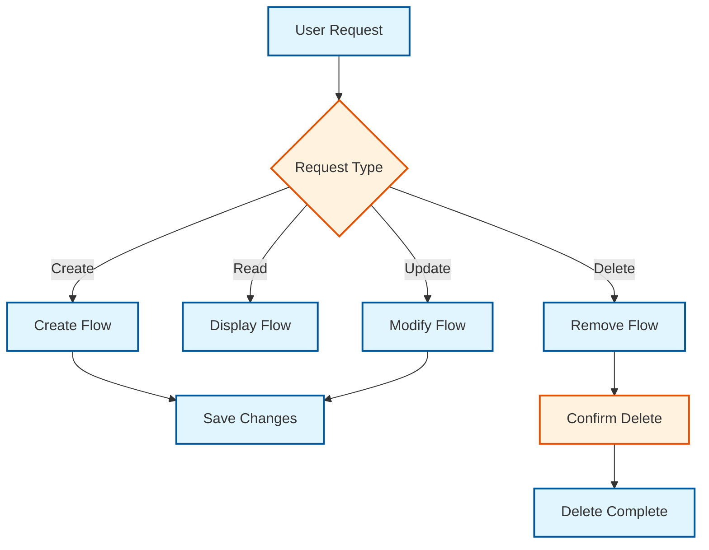

# 🌐 PyMermaidView Web Interface

## 🚀 Quick Start

### Method 1: Using the Batch File (Easiest)
```bash
# Double-click or run:
start_web_ui.bat
```

### Method 2: Command Line
```bash
# Navigate to project directory
cd c:\MyProjects\PyMermaidView

# Start the web interface
streamlit run streamlit_app.py

# Open browser to: http://localhost:8501
```

## ✨ Features

### 📝 Interactive Editor
- **Syntax Highlighting**: Advanced Mermaid code editor with syntax highlighting
- **Real-time Validation**: Instant feedback on syntax errors and warnings
- **Auto-completion**: Smart suggestions for Mermaid syntax

### 🗂️ Template System
- **Built-in Templates**: Pre-designed flowchart templates
- **Quick Builder**: Generate flowcharts from simple step descriptions
- **One-click Loading**: Load templates with a single click

### 🎨 Advanced Generation
- **Multiple Themes**: Generate diagrams in 4 different visual themes
- **High Resolution**: Configurable width, height, and scale factors
- **Format Support**: PNG, SVG, PDF, and JPEG output formats
- **Batch Generation**: Generate all themes at once

### 👁️ Live Preview
- **Instant Preview**: See your diagram as you type
- **Interactive Gallery**: Browse generated images with details
- **Download Management**: Easy download of generated images

## 📋 User Interface Guide

### Left Panel - Diagram Editor
1. **Template Selection**: Choose from built-in templates or start from scratch
2. **Quick Builder**: Create simple flowcharts by entering steps
3. **Code Editor**: Write or edit Mermaid syntax directly
4. **Validation**: Check syntax and get feedback

### Right Panel - Preview & Generation
1. **Generation Settings**: Configure theme, format, size, and scale
2. **Generation Controls**: Generate single images or all themes
3. **Live Preview**: View generated images with details
4. **Download Section**: Download images with original filenames

## 🔧 Generation Settings

### Themes Available
- **Default**: Clean, professional look (blue theme)
- **Dark**: Dark background for presentations
- **Forest**: Green accent theme
- **Neutral**: Minimal, grayscale theme

### Output Formats
- **PNG**: Best for web and presentations (recommended)
- **SVG**: Vector format, perfect for print and scaling
- **PDF**: Document-ready format
- **JPEG**: Compressed format for smaller file sizes

### Size Configuration
- **Width**: 400-2400 pixels (default: 1200)
- **Height**: 300-1800 pixels (default: 800)
- **Scale**: 0.5x-3.0x (default: 2.0 for high resolution)

## 📖 Mermaid Syntax Quick Reference

### Basic Flowchart Structure


### Node Shapes


### Styling Classes


## 🎯 Usage Examples

### Example 1: Simple Process Flow


### Example 2: Decision Tree


## 🚀 Advanced Features

### Template Customization
1. Load a template using the template selector
2. Modify the generated code in the editor
3. Generate your customized diagram
4. Save as a new template (coming soon)

### Batch Processing
1. Set your preferred generation settings
2. Click "Generate All Themes" 
3. Get 4 different themed versions instantly
4. Download all or select specific themes

### Validation & Debugging
- Real-time syntax checking
- Detailed error messages with line numbers
- Warning system for potential issues
- Suggestions for common fixes

## 🔥 Pro Tips

1. **Use the Quick Builder** for rapid prototyping of simple flows
2. **Start with templates** and customize them to save time
3. **Generate all themes** to see which works best for your use case
4. **Use high scale factors (2.0x)** for crisp, publication-quality images
5. **Validate before generating** to catch syntax errors early
6. **Use meaningful node IDs** for easier maintenance

## 🆘 Troubleshooting

### Common Issues

**Syntax Errors**
- Ensure you start with `flowchart TD` or `flowchart LR`
- Check for missing arrows (`-->`)
- Verify node ID consistency

**Generation Failures**
- Check if Playwright is installed: `python -m playwright install`
- Ensure sufficient disk space for image generation
- Try smaller image dimensions if generation is slow

**Template Issues**
- Refresh the page if templates don't load
- Check console for JavaScript errors
- Restart Streamlit if persistent issues occur

### Getting Help
- Check the [Mermaid Documentation](https://mermaid.js.org/)
- Review syntax examples in the interface
- Use the validation feature to debug syntax

## 🎉 What's New in Web Interface

- **Interactive Editor**: Real-time syntax validation and preview
- **Template System**: Built-in templates with one-click loading
- **Multi-theme Generation**: Generate all themes with one button
- **Advanced Controls**: Granular control over output settings
- **Download Management**: Easy access to all generated files
- **Responsive Design**: Works on desktop and tablet devices

---

**Happy Diagramming! 🎨**