# 🤖 PyMermaidView AI Enhancement Guide

## Overview

PyMermaidView now includes **AI-powered diagram enhancement** using Ollama local LLM, along with improved UI features for a better user experience.

## 🌟 New Features

### 1. 🤖 **"Enhance with AI" Button**

The AI enhancement feature uses your local Ollama installation to improve Mermaid diagrams automatically.

**Enhancement Types:**
- **🔧 General Improvement**: Overall diagram enhancement with better node names, structure, and best practices
- **🎨 Add Visual Styling**: Adds professional colors, styling, and visual enhancements
- **⚡ Optimize Structure**: Restructures the diagram for better clarity and readability

**How to Use:**
1. Enter or load a Mermaid diagram in the editor
2. Click the **"🤖 Enhance with AI"** button
3. Choose enhancement type from the expanded options
4. Wait for AI processing (shows "🤖 Enhancing..." while working)
5. Enhanced code automatically replaces your current diagram
6. Enhancement history is tracked in the session

### 2. 📱 **Collapsible Sidebar**

**New Behavior:**
- Sidebar starts **collapsed by default** for more screen space
- Click the **">"** arrow to expand and access configuration options
- All settings organized in expandable sections:
  - **🖼️ Image Generation**: Theme, format, dimensions
  - **🤖 AI Enhancement Setup**: Ollama status and setup instructions

### 3. 🔍 **Zoom Controls in Preview Area**

**Moved from Sidebar to Image Preview:**
- **🔍➕ Zoom In**: Increase image size by 25%
- **🔍➖ Zoom Out**: Decrease image size by 25%  
- **🔄 Reset Zoom**: Return to 100% size
- **Zoom Level Display**: Shows current zoom percentage

**Benefits:**
- More intuitive placement near the image
- Frees up sidebar space
- Better user experience for image interaction

## 🛠️ Ollama Setup Guide

### Prerequisites
- **Ollama installed locally**
- **At least one language model downloaded**

### Quick Setup

1. **Install Ollama:**
   ```bash
   # Linux/Mac
   curl -fsSL https://ollama.ai/install.sh | sh
   
   # Windows: Download from https://ollama.ai
   ```

2. **Start Ollama Service:**
   ```bash
   ollama serve
   ```

3. **Download a Model:**
   ```bash
   # Recommended model (fast and good quality)
   ollama pull llama3.2
   
   # Alternative models
   ollama pull llama3.1
   ollama pull qwen2.5-coder
   ```

4. **Verify Setup:**
   ```bash
   curl http://localhost:11434/api/tags
   ```

### Status Monitoring

The sidebar includes **real-time Ollama status monitoring**:
- ✅ **Green**: Ollama running with models available
- ⚠️ **Yellow**: Ollama running but no models found
- ❌ **Red**: Ollama not running or not accessible

## 🎯 Usage Examples

### Example 1: Basic Enhancement
**Original:**


**After AI Enhancement:**


### Example 2: Adding Styling
**Original Pie Chart:**


**After Styling Enhancement:**

```mermaid
%%{init: {"pie": {"textPosition": 0.5}, "themeVariables": {"pieOuterStrokeWidth": "5px"}}}%%
pie title Pet Adoption Statistics
    "Dogs 🐕" : 386
    "Cats 🐱" : 85
    "Birds 🐦" : 15
```


## 💡 Tips & Best Practices

### For Best AI Enhancement Results:
1. **Start with Basic Structure**: Provide a clear, basic diagram first
2. **Use Descriptive Names**: AI works better with meaningful node names
3. **Iterate**: Try different enhancement types for various improvements
4. **Review Results**: Always validate enhanced diagrams before using

### Enhancement History:
- Session tracks all enhancements made
- View count in the AI Enhancement Options panel
- Each enhancement shows type applied (improve/styling/optimize)

### Performance Tips:
- **Local Processing**: All AI happens on your machine (privacy-friendly)
- **Model Choice**: `llama3.2` recommended for speed and quality
- **Network**: No internet required once Ollama is set up

## 🔧 Troubleshooting

### Common Issues:

1. **"Ollama not running" Error**
   ```bash
   # Start Ollama
   ollama serve
   ```

2. **"No models found" Warning**
   ```bash
   # Download a model
   ollama pull llama3.2
   ```

3. **Enhancement Button Disabled**
   - Check if text area has content
   - Verify Ollama status in sidebar

4. **Slow AI Processing**
   - Normal for first request (model loading)
   - Consider smaller models like `llama3.2:1b`
   - Ensure sufficient RAM (8GB+ recommended)

### Port Configuration:
- Default Ollama port: `11434`
- Streamlit app port: `8507`
- Both should be accessible on `localhost`

## 🚀 Advanced Features

### Model Customization:
Edit `streamlit_app.py` to change the default model:
```python
payload = {
    "model": "your-preferred-model",  # Change here
    # ... other options
}
```

### Custom Enhancement Prompts:
Modify the `prompts` dictionary in `enhance_with_ai()` function to customize AI behavior.

### Integration with Other Tools:
The enhanced diagrams work with all existing PyMermaidView features:
- ✅ Validation
- ✅ Image generation
- ✅ All 9 diagram types
- ✅ Export functionality

## 🎉 Getting Started

1. **Launch Enhanced App:**
   ```bash
   streamlit run streamlit_app.py --server.port 8507
   ```

2. **Open Browser:**
   Navigate to `http://localhost:8507`

3. **Try AI Enhancement:**
   - Load any template
   - Click "🤖 Enhance with AI"
   - Expand options to choose enhancement type
   - Watch your diagram improve automatically!

4. **Use New Zoom Controls:**
   - Generate an image first
   - Use 🔍➕ 🔍➖ 🔄 buttons in preview area
   - Zoom level displays in real-time

The enhanced PyMermaidView combines the power of local AI with an improved user interface for the best diagram creation experience! 🚀