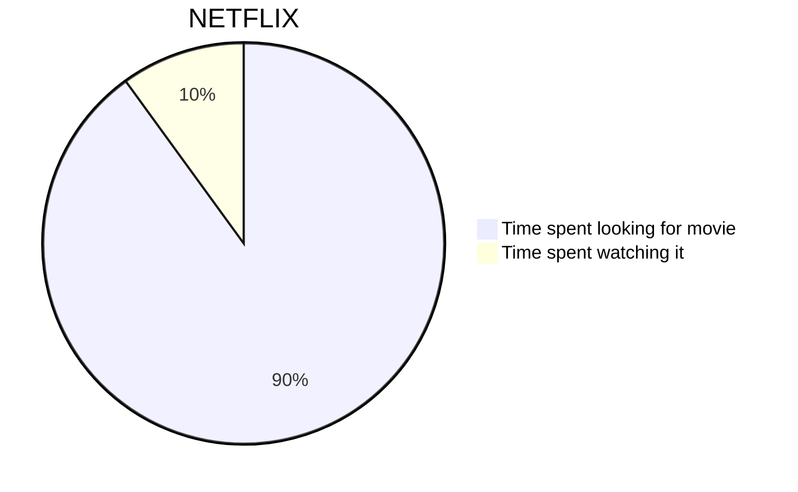
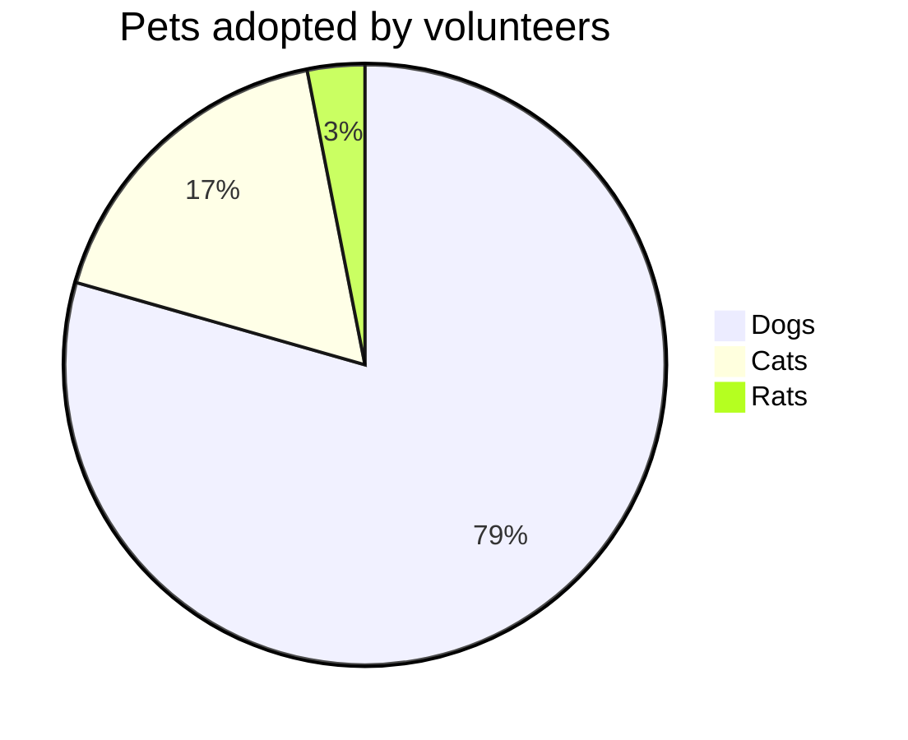
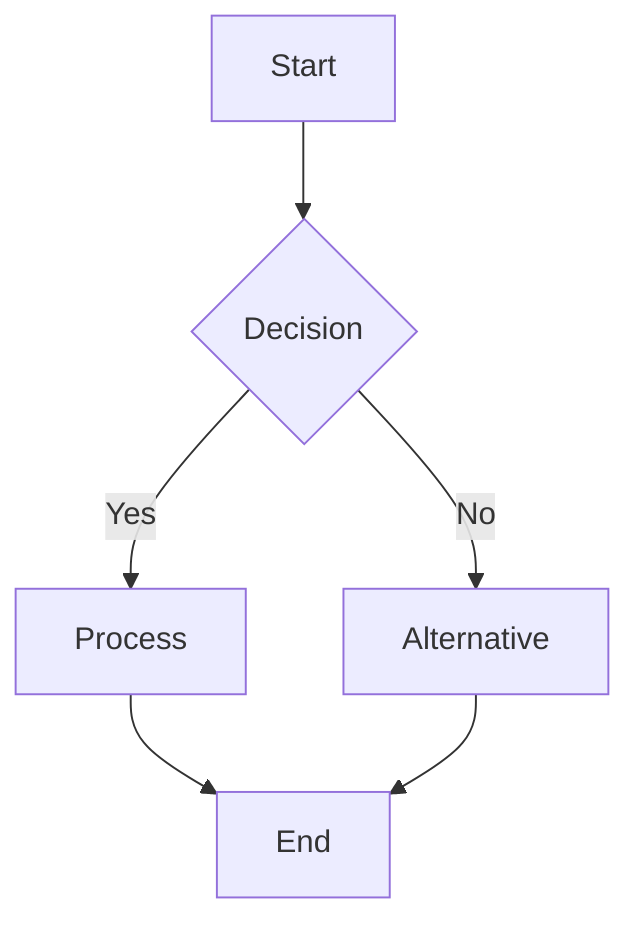
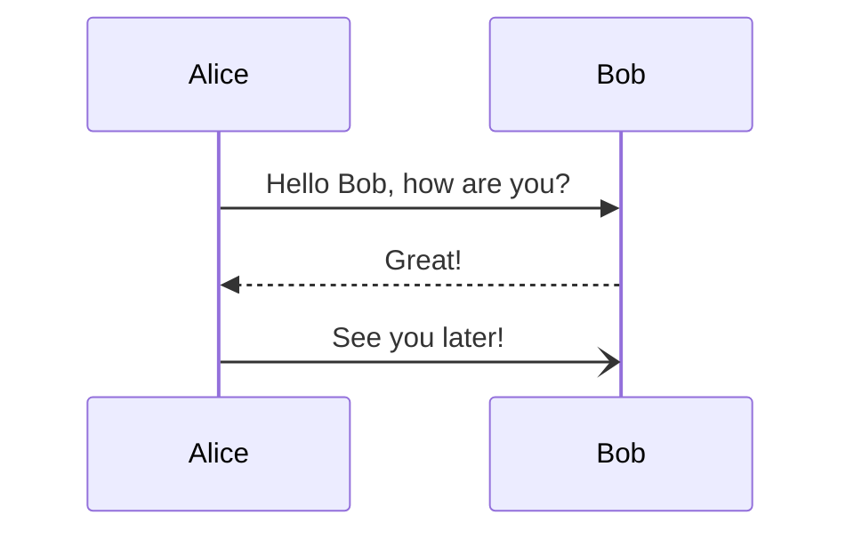
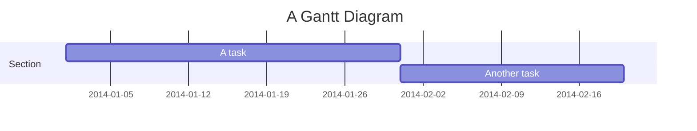
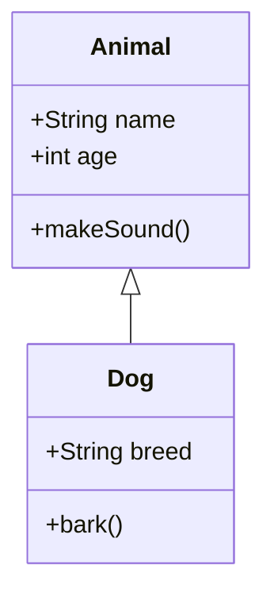

# 🎨 PyMermaidView Web Interface - Chart Examples

## 🌐 Access the Web Interface

The Streamlit web interface is running at: **http://localhost:8503**

## 📊 Supported Chart Types & Examples

### 1. Pie Charts 🥧

**Your Working Examples:**





**Features:**
- ✅ Validation: Works perfectly
- ✅ Generation: Creates high-quality images
- ✅ Preview: Real-time preview in browser

### 2. Flowcharts 🔄



### 3. Sequence Diagrams 📋



### 4. Gantt Charts 📅



### 5. Class Diagrams 🏗️



## 🎯 Web Interface Features

### Input Section (Left Panel)
- **Syntax Editor**: Code editor with syntax highlighting
- **Template Selector**: Quick-start templates
- **Example Library**: Pre-built examples for different chart types

### Preview Section (Right Panel) 
- **Live Preview**: Real-time rendering as you type
- **Multiple Themes**: Default, Dark, Forest, Neutral
- **Download Options**: PNG, SVG, PDF formats
- **High Resolution**: Configurable width, height, and scale

### Validation & Generation
- **Instant Validation**: Real-time syntax checking
- **Error Messages**: Clear error descriptions
- **Success Indicators**: Visual feedback for valid syntax
- **Multi-format Export**: Download in various formats

## 🔧 How to Use

### Step 1: Open the Interface
Navigate to **http://localhost:8503** in your browser

### Step 2: Enter Your Syntax
Paste your Mermaid syntax in the left text area:
```
pie title Pets adopted by volunteers
    "Dogs" : 386
    "Cats" : 85
    "Rats" : 15
```

### Step 3: Validate
Click "🔍 Validate Syntax" to check for errors

### Step 4: Configure Options
- Choose theme (Default, Dark, Forest, Neutral)
- Set dimensions (width × height)
- Select output format (PNG, SVG, PDF)
- Adjust scale for resolution

### Step 5: Generate & Preview
Click "🎨 Generate Image" to create the diagram

### Step 6: Download
Use the download button to save the image

## ✅ Fixed Issues

### OutputFormat Error Resolution
- **Problem**: `'PNG' is not a valid OutputFormat`
- **Cause**: Enum values are lowercase (`"png"`) but code used uppercase (`"PNG"`)
- **Solution**: Changed `.upper()` to `.lower()` in configuration
- **Status**: ✅ **FIXED** - All formats now work correctly

### Pie Chart Validation
- **Problem**: Validator only recognized flowchart syntax
- **Solution**: Enhanced validator to support multiple diagram types
- **Status**: ✅ **FIXED** - Pie charts, flowcharts, and other types supported

## 🚀 Next Steps

1. **Test Your Charts**: Try different Mermaid syntax types
2. **Experiment with Themes**: See how different themes affect your diagrams  
3. **Export Options**: Download in different formats for various use cases
4. **Template Library**: Use built-in templates for quick starts

## 📝 Quick Tips

- **Real-time Preview**: Changes appear instantly in the preview
- **Validation First**: Always validate before generating to catch syntax errors
- **High Resolution**: Use scale=2.0 or higher for crisp, publication-ready images
- **Theme Selection**: Dark theme works great for presentations, Default for documentation

Your PyMermaidView web interface is now fully functional with pie chart support! 🎉